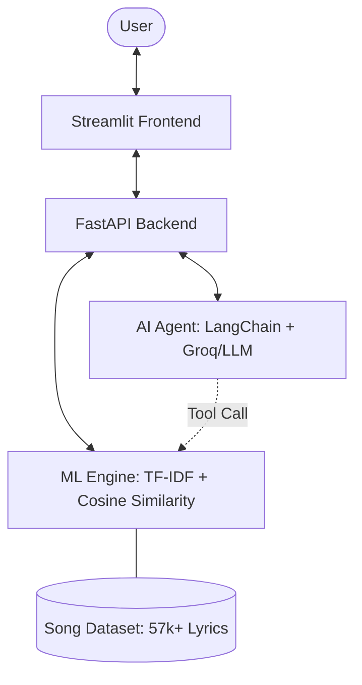

**VibeCheck** is a sophisticated music recommendation platform that bridges the gap between traditional Machine Learning and modern Conversational AI. It leverages a robust ML engine for lyrical analysis and a LangChain-powered agent for an interactive, personalized "music concierge" experience.

---

##  Key Features

-   **Hybrid Recommendation Engine**: Combines TF-IDF vectorization and Cosine Similarity for precise lyrical matching.
-   **AI Music Concierge**: Integrated LangChain agent (via Groq/OpenAI) that understands natural language queries like "I need something upbeat but soulful."
-   **⚡ High-Performance Backend**: Built with FastAPI for asynchronous, low-latency API responses.
-   **Premium UI/UX**: A dark-themed, glassmorphic Streamlit interface designed for a modern aesthetic.
-   **Contextual Understanding**: The AI Assistant doesn't just recommend; it explains *why* a song fits your current vibe.

---
## Note
# 1. you can built your own ui preference . I jus try something new


---
## System Architecture



### How it Works
1.  **Lyrical Analysis**: Songs are processed using NLTK for tokenization and stop-word removal.
2.  **Vector Space**: TF-IDF transforms lyrics into a 5,000-dimensional vector space.
3.  **Similarity Engine**: Cosine similarity identifies the nearest neighbors in the vector space to find matches.
4.  **Agentic Layer**: The LangChain agent acts as a controller, deciding when to query the ML engine based on user conversation.

---

##  Tech Stack

-   **Frontend**: Streamlit, Custom CSS (Glassmorphism)
-   **Backend**: FastAPI, Uvicorn
-   **ML/NLP**: Scikit-learn, Pandas, NLTK, Joblib
-   **AI Framework**: LangChain, Groq LLM
-   **Data**: 57,000+ Spotify Song Lyrics

---

## Getting Started

### 1. Clone & Setup Environment
```bash
git clone https://github.com/XXXVIIMMI/VibeCheck.git
cd VibeCheck

# Using Conda
conda create -n vibecheck python=3.11 -y
conda activate vibecheck

# Install Dependencies
pip install -r requirements.txt
```

### 2. Configuration
Create a `.env` file in the root directory:
```env
GROQ_API_KEY="your-groq-api-key"
GROQ_MODEL="llama3-70b-8192" # Or your preferred model
```

### 3. Generate ML Models
Before launching, process the dataset to generate the similarity matrices:
```bash
python -m app.core.preprocessor
```
*This creates `df_cleaned.pkl`, `tfidf_matrix.pkl`, and `cosine_sim.pkl` in the `data/` directory.*

### 4. Launch the Application

**Option A: Full UI Experience (Recommended)**
```bash
streamlit run app/ui/app.py
```

**Option B: FastAPI Backend Only**
```bash
python -m app.api.main
```
*The API will be available at `http://localhost:8000`. Access docs at `/docs`.*

---

## Project Structure

```
├── app/
│   ├── api/          # FastAPI backend services & routes
│   ├── ui/           # Streamlit frontend & custom styling
│   └── core/         # ML models, preprocessing & AI agent logic
├── data/             # Datasets and serialized model files (.pkl)
├── notebook/         # EDA and prototype notebooks
└── requirements.txt  # Project dependencies
```

##  License

Distributed under the MIT License. See `LICENSE` for more information.

---


